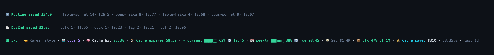

[한국어](./README.md) · **English**

[](https://www.youtube.com/@DeepPulseKR)
[](https://www.youtube.com/@DeepPulseEN)
[](https://rootstudioyaml.github.io/)
[](https://www.npmjs.com/package/claude-token-saver)

# claude-token-saver

**Diagnose Claude Code token usage from a single statusline — and route the easy work your expensive model keeps repeating down to cheaper models.** Zero dependencies, one-line install.

Since v3.x this is more than after-the-fact monitoring: it's a **model-fitting routing layer**. Session logs are classified into tiers (T0/T1/T2), recurring patterns get promoted to "haiku/sonnet is enough for this" delegation rules, and your main model auto-delegates them from the next session ([route-scan](#-route-scan--this-recurring-task-could-run-on-a-cheaper-tier)).

```bash
npm i -g claude-token-saver   # postinstall auto-registers the statusline + Skill
```



## 📺 Came here from the video? — 60 seconds

This is not a router. It never intercepts a request in realtime.
**After a session ends** it reads your local logs, finds the easy patterns your expensive model
kept handling, and promotes them into rules so a cheaper model takes them **from the next session
onward**. Rules are scoped global or per-project.

```bash
npm i -g claude-token-saver@latest
claude-token-saver route-scan         # find delegation candidates in your own history (0 LLM calls)
claude-token-saver route-scan rules   # list promoted rules · rm <N> to remove
```

Thresholds come from **your own last-14-day distribution (p25/p75)**, not someone else's benchmark.
Measured rule-health — whether a delegated run actually succeeded — landed in [v3.9.0](#v390-2026-08-01).


## ⚡ Why — the 30-second pitch

| | |
|---|---|
| 🔀 **Model-fitting delegation** | Classifies the easy work your expensive model (opus/fable) keeps repeating into tiers (T0/T1/T2) → promotes haiku/sonnet delegation rules, auto-applied from the next session |
| 💸 **−18.6% measured cost** | Cost per user message $2.35 → $1.91 after adopting harness+ratchet (author's logs, [details](#real-world-impact--beforeafter-report)) |
| 🚨 **No surprise rate limits** | Instant warning when the 5H/7D window hits 90% + `handoff` to back up your work |
| 🧠 **Cache waste detection** | Hit rate, TTL countdown, 1M-context detection — token spikes diagnosed with issue codes |
| 🅷 **Stop repeating mistakes** | Recurring errors get promoted to ratchet rules — auto-applied from the next session |
| 💰 **Savings made visible** | See what prompt caching saved you, live (`💰 Cache saved $2.1K`) |

📺 [Launch Short (60s)](https://www.youtube.com/shorts/RaD8qMsPTnA)

---

## Getting started

**Prerequisite:** Node.js ≥ 18 (`node -v` · macOS `brew install node` · Windows `winget install OpenJS.NodeJS.LTS` · Linux/WSL: [nvm](https://github.com/nvm-sh/nvm) recommended)

```bash
npm uninstall -g claude-cache-monitor   # (previous-package users only)
npm i -g claude-token-saver
```

The statusline appears at the bottom of Claude Code right away. If auto-registration was skipped (`--ignore-scripts`, sudo, sandboxed installs), run `claude-token-saver install`.

> ⚠️ Avoid `sudo` global installs — the Skill lands in root's `~/.claude` instead of yours. Use nvm/fnm/Volta or `npm config set prefix ~/.npm-global`.

## Reading the statusline

```
🤖 Opus 4.8 · 🧠 Cache hit 98.0% · ⏳ Cache expires 58:38 · ✦ current █░░░░░ 15% 🔄 08:50 · 📅 weekly █▒░░░░ 24% 🔄 Thu 13:00 · 📦 Ctx 200k · 💰 Cache saved $205 · last 1d
```

| Segment | Meaning |
|---|---|
| `🤖` | Active model |
| `🅷 5/5` | Harness principle score ([Harness mode](#-harness-mode)) |
| `🧠` | Cache hit rate (green at 85%+) |
| `⏳` | Cache TTL countdown — send a message before expiry to keep the cache warm |
| `✦ current` / `📅 weekly` | 5-hour / 7-day rate-limit window usage + reset time |
| `📦` | Context usage (e.g. `Ctx 68% of 1M`) — colored by fill. Current models default to 1M with no premium, but token volume itself drives per-turn cost and 5H/7D burn |
| `💰` | Cumulative savings from prompt caching |

When something is wrong, a **warning chip leads the line**:

```
🚨 5H █████▓ 94% 🔄 12:36 · 🅷 5/5 · 🤖 Opus 4.8 · 🧠 Cache hit 72.1% · ⚠ Cache miss · 📅 weekly ▓░░░░░ 12% 🔄 Sun 14:26 · 📦 Ctx 200k · last 1d
```

Chips — `🚨 5H/7D NN%` (cap imminent) · `⚠ Ctx 200k+` (a single request actually exceeded 200k) · `⚠ Cache miss` · `⚠ Input spike` · `⚠ Output heavy` · `⚠ Call surge` · `⚠ Rebuild churn` · `⚠ 5m TTL`. When both windows cross 90% at once, the sooner-resetting one is promoted to 🚨 and the other stays visible as a red segment (v2.16.0+).

### When a chip appears

Run the `/claude-token-saver` Skill inside Claude — or just say the chip wording ("5H cap is up", "cache miss") and it auto-activates. The Skill surfaces the **root-cause code + step-by-step fix**. When a cap is imminent, run `claude-token-saver handoff` to back up your work state to markdown and continue in a fresh session.

## Commands

Run these in your shell (inside Claude Code, the `/claude-token-saver` Skill is the only entry point):

| Command | What it does |
|---|---|
| `claude-token-saver` | Last-1-day diagnostic report (`--days N` / `--hours N`) |
| `claude-token-saver last` | Most recent warning + remediation |
| `claude-token-saver history` | Last 7 days of warning transitions |
| `claude-token-saver handoff` | Back work up to `HANDOFF-*.md` before a cap blocks you |
| `claude-token-saver mode [keywords...]` | Output config (`icon`/`text`, `en`/`ko`, `1h`–`30d` window, …) |
| `claude-token-saver harness ...` | 🅷 Harness management (below) |
| `claude-token-saver route-scan` | Detect recurring easy work on expensive models → propose haiku-delegation ratchet rules (below) |
| `claude-token-saver compact-window` | Warn when a 1M-context session has no auto-compact cap → pin 400k with `set` (below) |
| `claude-token-saver install` | Manually register Skill + statusline |

Switch output language with `mode ko` / `mode en` (English default; statusline chips stay symbolic).

<details>
<summary>All CLI options</summary>

| Flag | Description | Default |
|------|-------------|---------|
| `--days, -d` | Analysis period in days | 30 |
| `--hours` | Analysis window in hours (overrides `--days`) | – |
| `--format, -f` | `table` / `json` / `csv` | table |
| `--project, -p` | Filter by project directory | all |
| `--threshold` | Hit-rate alert threshold (0.0–1.0) | 0.7 |
| `--statusline` | One-line statusline output | – |
| `--icon` | Use 🧠 / ⏳ / 💰 / 📦 icons | text |
| `--verbose` | Longer labels | – |
| `--no-timer` | Hide TTL countdown | show |
| `--no-color` | Strip ANSI codes | – |
| `--segments=…` | Limit statusline segments (e.g. `model,five_hour,seven_day,saved`) | all |
| `--install-hook` / `--uninstall-hook` | Manage the PostToolUse hook | – |
</details>

## 🅷 Harness mode

Bootstrap five engineering principles (Ratchet · Evidence · PEV · Structured Task · Default Safe Path) into `CLAUDE.md` with one command; the statusline scores it as `🅷 5/5`. When the same error keeps recurring, a `🅷⚠ ratchet?` nudge appears so you can promote it to a rule.

```bash
claude-token-saver harness init                # this project
claude-token-saver harness init --global       # ~/.claude/CLAUDE.md — every project
claude-token-saver harness check               # current score (global fallback honored)
claude-token-saver harness promote <N> --project|--global   # warning #N → ratchet rule (scope required)
claude-token-saver harness promote "<rule text>" --project|--global  # register your own hand-written rules the same way
claude-token-saver harness pull                # register the package's curated ratchet rules into your global ratchet (opt-in, dedupes)
claude-token-saver harness list / rm <N>       # view / delete rules (auto .bak)
claude-token-saver harness off | on            # toggle the 🅷 chip
```

- `promote` **requires** `--project`/`--global` in non-TTY contexts (scripts, LLM calls) — a scope choice is never silently made for the caller.
- `pull` registers the **author-curated ratchet rules** bundled with the package (`presets/ratchet-rules.md` — only general-purpose rules promoted from real recurring mistakes) into your global ratchet (`~/.claude/ratchet.md`). `install`/`init` never auto-inject anything; `pull` is always opt-in and idempotent. Drop any rule you dislike with `harness rm`.
- 🅷⚠ runtime warnings (`ratchet?` `no-evidence` `PEV-skip`) expire after 30 minutes, subdirectory sessions match their project correctly, and PEV-skip counts only mutating tools (Edit/Write/Bash) so read-only research sessions don't trip it (v2.16.0+).

<details>
<summary>⚠️ <code>harness rm</code> — checklist before deleting</summary>

The whole point of the ratchet is **one-direction accumulation**. Deleting rules casually means the same mistakes return.

- **Rule too broad, blocking valid cases?** → ❌ delete ✅ narrow the condition (e.g. `"no hardcoded values"` → `"no hardcoded values outside tests"`)
- **Rule too narrow, almost never fires?** → ❌ delete ✅ leave it (zero cost)
- **Genuinely wrong?** → ✅ delete then

An auto `.bak` is kept, but **the session context that earned the rule its place is not recoverable.**
</details>


## 📦 compact-window — pin where a 1M session compacts

Claude Code compacts when usage approaches `min(autoCompactWindow, model max context)`. On a 1M window, with that value unset, compaction only fires near 800k — and until then every request re-bills the whole context. **1M is too large; the recommendation is a 400k–700k band** — 2–3.5x a 200k session's headroom for the genuinely large pastes, with the runaway tail cut off.

**Anything inside the band is left alone.** 400k is the floor where the saving beats the extra compactions, and long sessions often want more room than that. Only an unset window, or one above 700k, is warned about (a smaller one is a deliberate, more aggressive choice).

**200k sessions are never warned** — their window is already at or below 200k, so the setting cannot change anything.

```bash
claude-token-saver compact-window                       # status (model, window, value, source)
claude-token-saver compact-window set --global          # pin 500k (mid-band) in ~/.claude/settings.json
claude-token-saver compact-window set --project         # pin it in <root>/.claude/settings.json
claude-token-saver compact-window set --global --value 600k   # explicit value (100k–1M)
claude-token-saver compact-window off | on              # toggle the warning
```

- On a 1M model with the value unset or above 700k, the statusline shows `🅷⚠ compact-window?` and the session briefing hands the model the exact registration command.
- Scope (`--global`/`--project`) is **required** for `set` — a global settings file is never edited on a guess.
- Every other key in `settings.json` is preserved and a `.bak` is written first. Malformed JSON aborts the write untouched.
- An exported `CLAUDE_CODE_AUTO_COMPACT_WINDOW` beats settings.json; `set` detects that and says so.

## 🔀 route-scan — "this recurring task could run on a cheaper tier"

Finds the easy work your expensive model (opus/fable) keeps redoing in your session logs and proposes **haiku/sonnet delegation rules**. Fully local, zero token cost.

- **T2 → haiku**: lookups, pasted-screen Q&A, simple runs — zero errors, near-zero mutation
- **T1 → sonnet**: build pipelines, status checks — few mutations, ≤1 error
- **T0 stays**: repeated errors, heavy mutation, design/analysis — the session model keeps it

Three design pillars:
1. Difficulty is judged by **outcome, not text guessing** — tool errors, mutating tool calls, output tokens
2. Thresholds **auto-calibrate to your own 14-day distribution** — fixed constants drift with workload
3. Promoted rules live in a tool-owned file (`.claude/ratchet-model.md`) that **refreshes itself every scan**, and a `⚠ rule-health` flag fires when a delegated category's error rate climbs — rules report their own staleness

```bash
claude-token-saver route-scan                    # scan (24h cache) + tiered candidates
claude-token-saver harness promote R1 --project  # promote candidate R1 to a model-fitting rule
claude-token-saver route-scan dismiss 1          # not interested — won't resurface
claude-token-saver route-scan rules              # list model-fitting rules (rm <N> to remove)
```

Dig deeper: **tier criteria & research evidence** → [docs/TIER_CRITERIA.md](./docs/TIER_CRITERIA.md) (Korean) · **rule-file mechanics, scan triggers, subagent setup** → [docs/ROUTE_SCAN.md](./docs/ROUTE_SCAN.md) (Korean + English)

### Behind a gateway (Bedrock / LiteLLM)

Through a corporate gateway the transcript records an inference-profile ARN where the model id belongs. That string says nothing about `opus` or `haiku`, so older versions read every session as Sonnet — which made **T1 (→sonnet) rules unreachable and zeroed the savings figures**.

Since v3.10.0 the profile id is mapped back to a role (main, opus, sonnet, haiku) and then to the alias your `ANTHROPIC_DEFAULT_*_MODEL` variables declare. The mapping is learned by joining each parent `Task` call to the subagent run it spawned via `toolUseId`. Below three observations, or when the role votes agree less than 80% of the time, the id stays `unknown` and drops out of the delegation aggregate rather than being guessed at.

For environments the learner cannot reach, write the mapping yourself in `<userDataDir>/profile-map.json`. Account id and region may be wildcarded:

```jsonc
{
  "modelAliases": {
    "arn:aws:bedrock:*:*:application-inference-profile/<PROFILE_ID>": "claude-opus-5"
  }
}
```

That file holds internal identifiers in plain text — do not commit it. On a direct-API machine it is never created and behaviour is unchanged.

## Spike issue codes

| Code | Meaning |
|---|---|
| `LARGE_INPUT_PER_REQUEST` | single request > 200k input tokens — per-turn re-billing and cap burn spike |
| `LOW_HIT_RATE` | cache hit rate < 50% |
| `BUCKET_5M_DOMINANT` | > 70% of cache writes hit the 5m bucket |
| `HIGH_OUTPUT_RATIO` | output/input > 0.15 (output is 5× input price) |
| `HIGH_REQUEST_COUNT` | session made 3×+ your median (tool loop?) |
| `FREQUENT_CACHE_REBUILD` | `cache_creation` > `cache_read` |

Remediation commands are OS-aware (`~/.zshrc` for macOS/Linux/WSL, `setx` for Windows).

## Real-world impact — before/after report


harness 5/5 + ratchet applied to the author's own Claude Code work, normalized **per user message** (cutoff 2026-05-02, Opus 4.7 pricing):

| metric | before (7d / 739 msgs) | after (2d / 157 msgs) | Δ |
|---|---:|---:|---:|
| cost / user message | $2.345 | $1.910 | **−18.6%** |
| output tokens / message | 7,391 | 6,052 | −18.1% |
| assistant turns / message | 9.73 | 8.83 | −9.2% |
| tool calls / message | 5.72 | 5.25 | −8.2% |

Same request resolved in fewer round-trips → first-try success rate up — the effect of PEV + Structured Task forcing one-shot delivery.

<details>
<summary>Measurement notes — why cache hit rate isn't included · sample caveats</summary>

- The author is on the Max plan (1-hour cache TTL) with hit rate already converged near ~98%, so little headroom there. **Pro-plan users (5-minute TTL)** likely see hit rate itself rise with the handoff-before-expiry workflow.
- Handoff-before-expiry: watch the TTL countdown, run `claude-token-saver handoff` just before expiry to dump work state into a markdown brief, start a fresh cache cycle. Same flow handles the 1M warning and cap chips.
- ⚠️ POST window is only 2 days (157 msgs); statistical confidence is low, and week-to-week topic mix differs, so the tool effect isn't cleanly isolated.
</details>

## Pricing (Jul 2026)

Per million tokens (USD), as used by the cost estimator:

| Tier | Models | Input | 5m Write | 1h Write | Read | Output |
|---|---|---|---|---|---|---|
| `claude-fable-5` | Fable 5 / Mythos 5 | $10 | $12.50 | $20 | $1 | $50 |
| `claude-opus-new` | Opus 4.5 / 4.6 / 4.7 / 4.8 | $5 | $6.25 | $10 | $0.50 | $25 |
| `claude-opus-legacy` | Opus 4 / 4.1 / 3 | $15 | $18.75 | $30 | $1.50 | $75 |
| `claude-sonnet` | Sonnet 3.7 / 4 / 4.5 / 4.6 / 5 | $3 | $3.75 | $6 | $0.30 | $15 |
| `claude-haiku-4-5` | Haiku 4.5 | $1 | $1.25 | $2 | $0.10 | $5 |

Source: [Anthropic pricing docs](https://platform.claude.com/docs/en/about-claude/pricing). Sonnet 5 has an introductory $2/$10 rate through 2026-08-31; the estimator uses the standard sticker. Versions ≤ 2.16.x priced Fable 5 at the Sonnet tier (~3× under-estimate) — upgrade to 2.17.0+.

### Cache TTL by plan

| Plan | TTL | Controlled by |
|---|---|---|
| Max ($100–200/mo) | **1h auto** | `tengu_prompt_cache_1h_config` flag |
| Pro ($20/mo) | **5m fixed** | not configurable |
| API key | 5m default (1h via beta header) | `cache_control.ttl` |

## How it works · Environment

Claude Code logs every API call to `~/.claude/projects/<dir>/<session>.jsonl`. This tool dedupes streaming chunks by `requestId` and aggregates `cache_read_input_tokens` / `cache_creation.ephemeral_5m/1h_input_tokens` by day and session.

Node.js ≥ 18 · macOS / Linux / Windows / WSL · **zero dependencies**.

<details>
<summary>Known quirks · Migration · Background</summary>

**IntelliJ Claude Code plugin** — the statusline widget fuses frames at the character level when emoji are present (`59:548` artifacts). v2.8.5+ detects `TERMINAL_EMULATOR=JetBrains-JediTerm` and falls back to text mode automatically.

**Migration from claude-cache-monitor:**
```bash
npm uninstall -g claude-cache-monitor && npm i -g claude-token-saver
```
Also update `statusLine.command` in `~/.claude/settings.json` to `claude-token-saver …`.

**Background:** [GitHub Issue #46829](https://github.com/anthropics/claude-code/issues/46829) (cache TTL regression) · [HN discussion](https://news.ycombinator.com/item?id=47736476) · [DeepPulse KR](https://www.youtube.com/@DeepPulseKR) / [EN](https://www.youtube.com/@DeepPulseEN) · [Homepage](https://rootstudioyaml.github.io/)
</details>

## Release notes

### v3.10.0 (2026-08-20)
- **Model tiers are detected again behind a Bedrock / LiteLLM gateway** — when the transcript's model id is an inference-profile ARN there is no `opus` or `haiku` in the string, so it fell back to Sonnet. Since `worthDelegating()` requires `rank > target`, **every T1 rule was rejected**, savings aggregated to zero, and cost was under-counted by roughly 1.67x. The profile id is now learned as a role (parent `Task` call joined to the subagent run by `toolUseId`) and mapped back to the alias your environment declares. The pricing table, the ranks, and the tiering logic are untouched.
- **No confident mapping means no guess** — under three observations, or below 80% agreement, the id stays `unknown` and leaves the delegation aggregate. Quietly calling it Sonnet was the worse failure.
- **Manual override** — `modelAliases` in `<userDataDir>/profile-map.json`, wildcards allowed. No profile id or AWS account id is ever hardcoded in this package.
- Direct-API machines behave **exactly as before** and no new file is written.

### v3.9.2 (2026-08-01)
- **Added a LICENSE file (MIT)** — the field existed in `package.json` but the file did not, which blocked license review for company adoption. It ships in the npm tarball now via `files`.
- **Package description and keywords rewritten for what this actually does** — leftover cache-monitoring copy meant it never surfaced for `model-routing` / `delegation` / `subagent`.
- **A 60-second on-ramp at the top of the README** — that this is post-hoc analysis rather than a router, plus the three commands from install to seeing your own numbers.
- **One-time note in `route-scan`** — prints the explainer link exactly once. Disable with `CTS_NO_NOTE=1`.

### v3.9.1 (2026-08-01)
- **compact-window now recommends a 400k–700k band instead of a single 400k** — 400k proved too tight in practice and compacted too often. The advice is a range now, and **a window inside it (or below it) is never warned about**; only an unset value or one above 700k raises `🅷⚠ compact-window?` and the briefing. `set` defaults to 500k (mid-band); pick your own with `--value 600k`.

### v3.9.0 (2026-08-01)

Compared this tool's design against manifest.build's "Everyone is building LLM routers, we deprecated ours" (a retrospective on 4 months across 7,000 users) and closed the four of their failure modes that were not already ruled out here. Full comparison in [TIER_CRITERIA.md §3.9](./docs/TIER_CRITERIA.md).

- **rule-health now watches real delegations** — the old error rate's denominator was "episodes the expensive model handled directly that merely *looked* delegable by shape". It never measured whether a rule succeeded **when it actually fired**, so a rule could fail every single time without moving the signal. Claude Code writes each subagent run to `<session>/subagents/`, and its meta `toolUseId` joins exactly onto the parent's Task call — so the outcome of a real delegation is now counted directly. Once 5 measured runs accumulate, they replace the shape-based proxy, and the warning says which evidence it is using. (Author's 14-day log: 4 of 106 sessions, 18 runs, 100% join rate.)
- **Per-rule savings** — the tokens a delegated run spent are re-priced at the session model's rate, and the difference is reported over the 14-day window as `~$` in `route-scan rules` and `ratchet-model.md`. You can only prune rules that aren't worth their keep if you can see which ones those are. A rule with no measured delegations shows `—`, not `$0` — the two mean opposite things.
- **Tiers are now relative to the session model** — the only gate used to be "is it haiku?", so a Sonnet session produced T1 rules telling it to delegate to Sonnet: a subagent rebuilding context for zero price difference, which is a net loss. Candidates are now only created when the target tier is genuinely cheaper (haiku 0 · sonnet 1 · opus 2 · fable 3).
- **Probe-then-commit budgets** — a rule is derived from statistics but **fires on the request text alone**, and most of what makes a task hard only shows up after the first tool call. That gap can't be closed, so the cost of getting it wrong is capped instead: every rule now carries a calibrated limit (T2: 8 tool calls / p25 output, T1: p75 output), and a run likely to exceed it — or hitting an error — stops there, reports partial progress, and hands back to the main model. The clause is composed at render time rather than baked into the stored rule, so **rules promoted before this release get it too**, and the promote preview can never drift from what lands in the file.

### v3.8.2 (2026-08-01)
- **Fixed: the context tier never came back down after compaction** — the tier was kept as a high-water mark, so a session that compacted at 80% stayed at tier 1 even though its context had just been emptied, and it refilled to the cap with no signal at all. The tier now follows the measurement down and warns again on the next climb.
- **Both windows are named** — with `autoCompactWindow` at 400k the briefing measured against 400k (80%) while Claude Code's own display measured against 1M (33%); two irreconcilable numbers for one session. The text now reads `자동 압축 창(400k)의 80% (… 화면의 1M 창 기준으로는 33%)`.
- **No "start a new session" advice when a compact window is set** — that threshold is exactly where compaction runs on its own, so the briefing suggests writing decisions and next steps to a file instead.

### v3.8.1 (2026-07-31)
- **Fixed: 1M sessions were judged against a 200k window** — the briefing inferred the window from the largest request seen so far, so a 1M session counted as 200k until it had already grown past 250k. At 160k of input it announced "past 80% of the 200k window" — really 16%. The window now comes from the configured model id, and when `autoCompactWindow` is set that is where the session actually turns over, so the percentage is measured against it (the text says `(autoCompactWindow 기준)`). The observed-size heuristic remains only as the fallback for an unreadable model id.

### v3.8.0 (2026-07-31)
- **New `compact-window` — 1M sessions had no compaction cap** — Claude Code compacts near `min(autoCompactWindow, model max context)`. On a 1M window with that value unset, compaction only fires around 800k, and every request until then re-bills the entire context. A 1M model with the value unset or above 400k now raises `🅷⚠ compact-window?` on the statusline plus a session briefing, and `compact-window set --global|--project` pins 400k. 200k sessions are exempt — the setting cannot change anything for them.

### v3.7.0 (2026-07-29)
- **Fixed: delegation rules named subagents that may not exist** — generated T2 rules hard-coded preset names like `haiku-explore` / `haiku-runner`, which live in each user's own `~/.claude/agents/` and are not shipped by this package. On a machine without them, the rule told the model to delegate to a nonexistent agent. The default phrasing is now `model: haiku` (matching T1's `model: sonnet`), and the name is added only when the agent file is really present, e.g. `haiku-explore(model: haiku)`. Project-level `.claude/agents/` counts too. `ratchet-model.md` re-renders with the new phrasing on the next `route-scan`.

### v3.6.4 (2026-07-29)
- **Fixed: false `🅷⚠ ratchet-unloaded`** — the import check looked at a single CLAUDE.md. When the project file carried the harness block, only that file was inspected, so the common layout of block-in-project + `@` imports-in-global raised the warning even though the rules loaded fine. Claude Code loads both files, so the flags are now the union of the two, and `importSource` (`project`/`global`/`both`) says which file carries them. The warning fires only when neither file imports.

### v3.6.3 (2026-07-27)
- **Fixed: approved ratchet rules never reached the session** — `harness promote` appended rules to `ratchet.md`, but nothing ever read that file. Claude Code loads `CLAUDE.md` (plus whatever it imports) and the harness block carried no import line, so "approved rules apply automatically from the next session" was unimplemented. The block now imports `@.claude/ratchet.md` (project) / `@~/.claude/ratchet.md` (global). Re-running `harness init` upgrades an existing block in place.
- **`ratchet-model.md` is imported explicitly too** — delegation rules now travel the same declared path instead of relying on a host that happens to pick the file up. To keep the import from dangling, `harness init` seeds an empty file and `syncAllFiles` empties rather than deletes a target that loses its last rule.
- **New `🅷⚠ ratchet-unloaded` warning** — all five sections can be present while the rules are dead weight, so a missing import is reported separately from `N/5`. `harness check` says the same thing and prints the fix.
- **New `harness prune`, plus ratchet size in `check`** — an imported ratchet costs tokens on every request. `harness check` now reports rule count and per-request tokens and warns past ~2,000. Trim with `harness prune [--tag <t>] [--older-than <months>] [--dry-run]`, which moves rules to `ratchet-archive.md` rather than deleting them. Prefix a rule with `[tags]` (`- 2026-05-08: [video] ...`) to prune by topic. (`@` imports are static, so load-time filtering is not possible — the only lever is fewer rules.)

### v3.6.2 (2026-07-26)
- Docs-only release — restores the missing v3.4.0–v3.5.3 release notes below. Published because the npm package page renders the README of the published version. No code changes.

### v3.6.1 (2026-07-26)
- **Fixed state files splitting apart on macOS and Windows** — `route-scan.json`, `model-rules.json`, and `brief-state.json` each carried a private copy of the path resolver, and those copies honored `XDG_CONFIG_HOME` on Linux only. With XDG set on macOS or Windows, `config.json` and the session cache moved while those three stayed at the platform default, so delegation-candidate briefings and promoted rules silently vanished. All of them now resolve through `paths.js`. (Caught by the 3-OS CI added in v3.6.0; a regression test now keeps a fourth copy from reappearing.)
- Fixed `npm test` failing on Node 22 — Node 22 resolves the directory argument of `node --test test/` as a module path.

### v3.6.0 (2026-07-26)
- **Statusline refreshes stop re-parsing everything** — parsed sessions are now cached under a `(path, mtime, size)` key. Transcripts are append-only, so that triple is a sound identity for a parse result. On a 217MB / 226-file 30-day window every refresh used to spend ~3s re-reading files that could not have changed; now only the files that actually grew (in practice, the current session) are read. A stale or corrupt cache is never fatal — every read path falls back to a full parse.
- **ratchet-model.md renders in English** — the model reads this file as instructions, so a Korean-only file dragged English sessions into Korean. Header, rule text, and rule-health warnings now follow the `language` setting. Category labels and rule text are stored in both languages at scan time, so switching languages takes effect immediately without a rescan.
- **Tests and CI** — `npm test` runs 22 `node:test` cases, and GitHub Actions runs them across ubuntu/macOS/Windows × Node 18/22. The cross-platform user-path handling (XDG / APPDATA / Application Support) is exactly what a single-OS run would miss.
- **bin/cli.js split up** — the 1,000-line CLI is now `src/commands/*` (install, harness, route-scan, brief, handoff, history, last, mode) plus arg-parsing and stdin-payload helpers. No behavior change.

### v3.5.3 (2026-07-22)
- **rule-health: self-corrected and harness-guard errors excluded** — edit-ordering guards and self-correction errors (`File not read yet`, `String to replace not found`, `modified since read`, `Blocked:`, Task lifecycle) are part of a flow the model recovers from on its own, not a difficulty signal. Continues the permission-noise cleanup from v3.4.2. Ambiguous `Exit code N` / `File does not exist` stay counted.

### v3.5.2 (2026-07-21)
- **Session-start briefing is delivered proactively** — the SessionStart hook's wording was conditional ("when you relay this"), so the model could file it away as background. It now explicitly asks for a summary at the end of the first response under a `※ [claude-token-saver]` label, even when the user's opening message is unrelated small talk.
- **Fixed a brief-seeding race** — the brief hook used to swallow every route/rule-health event on its first run; it now swallows only the signatures SessionStart actually briefed (`seedSessionBriefed()`). When a background rescan finishes just after session start and produces a new candidate, it used to go unmentioned for the whole session — now it's briefed on the next prompt.

### v3.5.1 (2026-07-14)
- **Hook install no longer overwrites schema-violating values** — a non-array `hooks.SessionStart` / `hooks.UserPromptSubmit` used to be replaced with an empty array. It's now skipped with a reason, to protect user data. Normal array merging (append, idempotent) is unchanged.

### v3.5.0 (2026-07-14)
- **Per-session change briefing hook (UserPromptSubmit)** — the model cannot see statusline chips, so mid-session state changes (context threshold crossed, new route candidate, rule-health flip) went unexplained until the user asked. Runs on every prompt submit and stays **completely silent when nothing changed** (zero context cost).
  - Context measurement and briefing markers are both keyed by session_id — window auto-detection (200k/1M), tiers at 80% and 95%, each announced once.
  - route/rule-health are seeded at the session's first event so they don't duplicate the SessionStart briefing; only what appears mid-session is injected.
  - The installer registers the UserPromptSubmit hook idempotently, and session state untouched for 7 days is pruned.

### v3.4.3 (2026-07-14)
- **Write-dominant episodes are no longer delegation candidates** — editing work (Edit/Write dominant) leaked into read/explore through generic keywords. Measured: a 5-edit doc session classified as read/T1 and generated 67% error-rate noise. A write-dominant episode now maps to translate only with explicit translate keywords, and otherwise to nothing at all.

### v3.4.2 (2026-07-14)
- **rule-health numerator cleaned up — permission-class errors excluded** — user tool denials, auto-mode classifier denials, and permission-denied errors reflect user intent and policy, not task difficulty. A full 14-day audit found ~25% of 142 `is_error` events were this class, and they were what pinned a 24% ⚠ flag on the global run/T1 rule (18% after exclusion, clearing it; the real run/T1 error rate went 23% → 8%).

### v3.4.1 (2026-07-14)
- **Minimum-sample guard for rule-health (`HEALTH_MIN_SAMPLE=10`)** — 1 error out of 4 samples (25%) was enough to raise a review flag. Below 10 eligible episodes in the window the rate is noise, so the flag is withheld.

### v3.4.0 (2026-07-14)
- **Behavior-first categorization** — `categorize()` rewritten from first-match regexes into three stages: paste gate → tool-usage histogram (`behaviorPool`) to narrow the candidate pool → weighted keyword scoring. **What the episode actually did outranks how the prompt was worded** ("check whether the tests pass" that really ran `npx playwright test` is a run episode regardless of phrasing).
- Added irreversible/external keywords to ESCALATE_RE (submit, deploy, release, merge, …) — they can look like light run episodes in the logs, but delegating them defeats the harness's default-safe-path rule.
- rule-health statistics keyed by `tier|category|project` — removes the double counting that happened when a category's T2 and T1 rules shared one bucket.
- ratchet-model.md rendering: a category's T2 and T1 rules are emitted as **one merged rule carrying the decision criteria at request time** (haiku by default → sonnet when multi-step → main model when irreversible).

### v3.3.1 (2026-07-13)
- **Plain language instead of codes** — bare `R1`/`T2` codes were unreadable for first-time users. Every user-facing listing (SessionStart hook briefing, `route-scan` candidates, `route-scan rules`) now spells tiers out as `T2 (simple — haiku-class is enough)` and scopes as `this project only` / `all projects (global)`. The hook briefing also instructs the model to relay the spelled-out explanation, not the codes. (Statusline chips keep the terse `route? R1` for width; the session briefing carries the meaning.)

### v3.3.0 (2026-07-13)
- **Delegation visibility & briefing** — the whole model-fitting loop is now surfaced to the user:
  - The SessionStart hook injects, per candidate, **the exact rule text that would be written to ratchet-model.md** — you see precisely what you're approving.
  - Rules flipped to review (delegated-category error rate over 20%) are announced on **both** the statusline (`🅷⚠ rule-health R<N>` chip — implementing the item from the design doc; precedence: session-quality warnings > rule-health > route? candidates) and the session-start briefing.
  - The ratchet-model.md header now instructs the model to prefix each delegation with `🔀 [claude-token-saver] model-fitting: "<category>" → <agent>` — making it visible which tool is saving your tokens.
- README updated to the 3.x identity (model-fitting delegation in the top pitch, collapsible research-evidence section under route-scan); fixed a stale comment in model-rules.js.

### v3.2.2 (2026-07-13)
- **No re-proposing registered rules** — (tier|category|project) combinations that already have a model-fitting rule are excluded from scan candidates (a global rule covers every project). Fixes rules registered outside the promote flow (e.g. migrations) resurfacing as candidates.

### v3.2.1 (2026-07-13)
- **Instant pattern analysis on first setup** — `install` (including npm postinstall) analyzes your existing session logs inline when no cache exists, so tier-delegation candidates appear from the very first Claude Code session (previously the second).

### v3.2.0 (2026-07-13)
- **Tier classification (T0/T1/T2)** — route-scan grows from a binary easy/other split into three tiers. New signals: mutating tool calls and tool errors; output thresholds auto-calibrate to the user's own distribution (clamped); a dedicated category for pasted screen/log Q&A; conversational episodes (<100 output tokens) excluded. Design and research evidence in `docs/TIER_CRITERIA.md`.
- **Model-fitting ratchet separated** — promoted delegation rules live in their own file (`.claude/ratchet-model.md` / `~/.claude/ratchet-model.md`), file-level-separated from hand-written rules, managed via `route-scan rules [rm <N>]`; the harness CLAUDE.md block references both files.
- **Log-driven auto-refresh + rule-health** — every rescan recomputes each registered rule's recurrence count and error rate (over delegation-shaped episodes) and rewrites the file. An error rate >20% flags the rule with `⚠ rule-health`, suggesting narrowing or removal.
- **Data-triggered rescans** — the fixed 24h TTL is gone; new transcript volume triggers rescans (~5MB → immediately, a trickle → daily, no change → skip, 1h minimum interval, one immediate refresh after promote).

### v3.1.0 (2026-07-13)
- **frugon integration removed** — the `claude-token-saver frugon` JSONL-export subcommand is gone. An external analyzer's aggregate report can't be turned into ratchet rules (condition → action), so it never fed the delegation pipeline; 3.x instead invests in **first-party tier classification over session logs**. route-scan is unaffected (the shared parser moved to `src/session-records.js`).

### v3.0.1 (2026-07-13)
- **`harness pull` redefined** — v3.0.0's "copy global ratchet → project" was pointless (the global ratchet already applies to every project as the upper layer of the hierarchy) and is removed. `pull` now registers the **author-curated ratchet rules** bundled with the package (`presets/ratchet-rules.md`) into your global ratchet — six general-purpose rules promoted from real recurring mistakes; opt-in and idempotent.

### v3.0.0 (2026-07-13)
- **Major bump** — with v2.19's frugon integration and v2.20's route-scan, the product's character shifted from "after-the-fact token monitor" to "a routing layer that pushes recurring easy work down to cheaper models", so this ships as a major. No breaking changes (every existing command and setting remains compatible).
- **route-scan promote fix** — `harness promote R<N> --project` now writes the rule into the `.claude/ratchet.md` of the project the candidate was **detected in** (previously it landed in whatever directory the CLI ran from). The scan stores each candidate's real session path (`projectPath`); promoting a foreign-project candidate from a pre-3.0 cache without that field is refused with a pointer to `route-scan --refresh`.
- **New `harness pull`** — redefined in v3.0.1 (see above).

### v2.20.0 (2026-07-13)
- **route-scan**: detect recurring easy work on expensive models → `🅷⚠ route? R<N>` chip + SessionStart hook context injection + `harness promote R<N> --project|--global` to promote haiku-delegation ratchet rules.

### v2.19.0 (2026-07-12)
- **frugon integration**: `claude-token-saver frugon` — export session transcripts as [frugon](https://github.com/Rodiun/frugon)-compatible JSONL for model-routing savings analysis (`--run` to analyze immediately; cache-weighted tokens by default).

### v2.18.0 (2026-07-02)
- **1M-context warning re-scoped** — current models (Fable 5, Opus 4.6–4.8, Sonnet 5) all default to a 1M window with no long-context premium since Opus 4.7, so the "1M mode ON = expensive" framing is retired. The warning is now a **usage signal**: `⚠ 1M ON` → `⚠ Ctx 200k+` (a single request actually exceeded 200k), and remediation is reordered to lead with `/compact`/`/clear` + `/effort` instead of "disable 1M". The incorrect "long-context pricing kicks in past 200k" copy is fixed.
- **📦 segment shows live usage** — reads `context_window.used_percentage` from Claude Code's stdin and renders `📦 Ctx 68% of 1M`, colored by fill (green <70 / yellow 70–89 / red 90+). Falls back to transcript-inferred size when stdin is absent (1M now yellow, not red).
- Back-compat: the legacy `⚠ 1M ON` chip and old detail strings in existing history files still resolve.

### v2.17.0 (2026-07-02)
- **Fable 5 pricing tier** — `claude-fable-5`/`claude-mythos-5` previously fell through to the Sonnet tier ($3/$15), under-estimating costs ~3×. Now priced at the real rates ($10 input / $50 output / $12.50 5m-write / $20 1h-write / $1 read).
- README overhaul — top-level impact summary, segment table, harness scope-flag docs, pricing table brought current.

### v2.16.0 (2026-07-02)
- **Statusline fixes** — when two rate-limit windows are ≥90% at once, only the cap-warn-promoted window is suppressed (the other stayed hidden before); `--no-color` output is truly ANSI-free; the no-session fallback line keeps cap-warn / 🅷 / model chips.
- **Harness warning accuracy** — 🅷⚠ warnings expire after 30 minutes (previously lingered indefinitely); session cwd normalized to the project root (subdirectory launches match); no-cwd states no longer leak into every project.
- **Fewer PEV-skip false positives** — only mutating tools count; windows sliced by assistant turns.

<details>
<summary>Older versions (v2.8.5 – v2.15.0)</summary>

### v2.15.0 (2026-06-13)
- **Global harness init** — `harness init --global` installs the 5 sections into `~/.claude/CLAUDE.md` (+ `~/.claude/ratchet.md`), applying to every project. `harness check` honors global as a fallback (`🅷 5/5 (covered by global)`).
- npm homepage change; @DeepPulseEN + homepage badges.

### v2.13.x (2026-05-04)
- "Real-world impact" restructured as the harness+ratchet before/after report; statusline screenshot + impact chart; npm metadata cleanup; YouTube handle fix.

### v2.11.0 (2026-05-02)
- `harness list` / `harness rm <N>` (auto `.bak`, "narrow the condition first" guidance).

### v2.9.x (2026-04-27)
- Output language toggle (`mode ko`/`en`) for `last`/`history`/advice; Skill responds in the configured language; Node.js prerequisite block; Skill workflow guide; `language` config location cleanup.

### v2.8.6 (2026-04-27)
- **Skill auto-registers on install** via postinstall hook.

### v2.8.5
- IntelliJ plugin frame-fusion workaround — auto text mode under JediTerm.

Older versions: see `git log`.
</details>

## License

MIT
